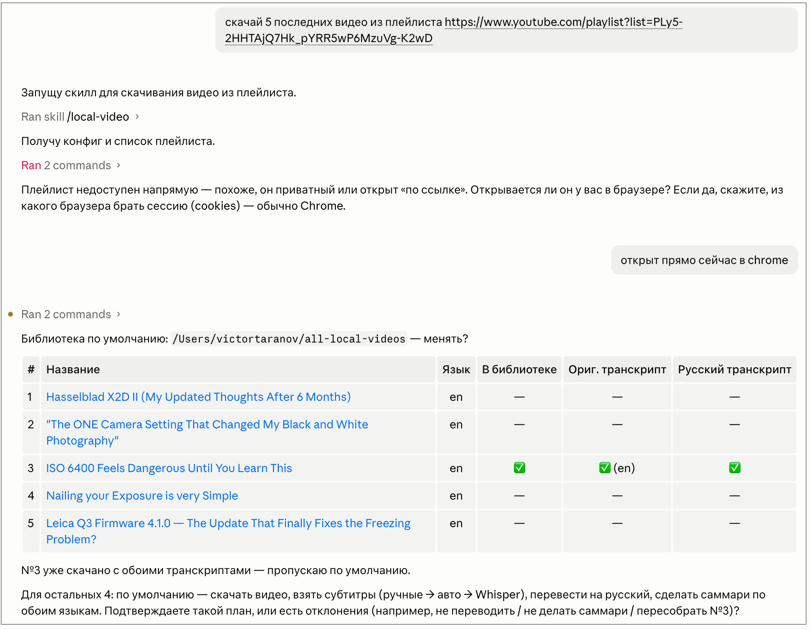
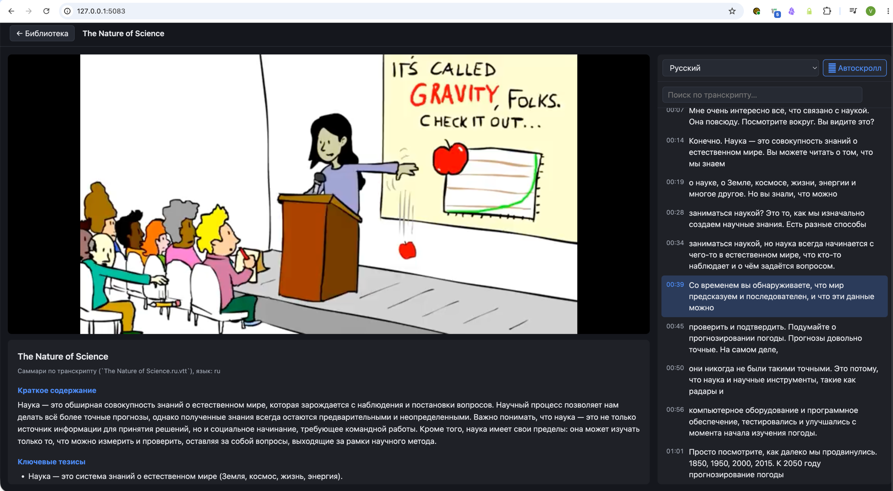

# local-video

<!-- github-about
description: Локально скачивает видео с YouTube (и других совместимых с yt-dlp источников) и делает к нему субтитры и саммари на русском. Оркеструется Claude Code. Используются локальные модели для транскрибирования и перевода. В комплекте веб-плеер с транскриптом.
topics: youtube, translation, subtitles, summarization, vtt, transcription, whisper, local-first, yt-dlp, faster-whisper, ollama, claude-code
-->

Скачивайте видео с YouTube (и других источников, поддерживаемых yt-dlp) и получайте к нему транскрипты и краткое содержание — в том числе **на русском**, даже если у видео нет готовых транскриптов. Всё работает **локально**: транскрипция через faster-whisper,
перевод и саммари — через локальную модель в Ollama. 

Цель — иметь видео всегда под рукой и всегда понятным на родном языке.

## Из чего состоит

```
local-video/
├── .claude/skills/local-video/   # Claude Code Skill — пайплайн обработки
│   ├── SKILL.md                  #   инструкция для Claude (когда что делать)
│   └── scripts/                  #   утилиты: probe, download_video, fetch_subs,
│                                 #   transcribe, translate, summarize, subs
└── player/                       # локальный веб-плеер (Flask): видео + кликабельный
                                  #   транскрипт; см. player/README.md
```

**Скилл** — навык для [Claude Code](https://claude.com/claude-code)

**Плеер** — отдельное веб-приложение для просмотра результата (видео рядом с
транскриптом, перемотка по клику, поиск). Подробности — в `player/README.md`.

## Использование

#### *Скачать видео*

Напишите Claude Code обычными словами, например:

```
> скачай видео https://www.youtube.com/watch?v=… , сделай русский транскрипт и запусти в плеере
```

Claude активирует скилл local-video и скачает видео, а также оригинальные и русские транскрипты (если есть). 
Если нет русского, будет выполнен перевод оригинального транскрипта через 
локальную модель, подключенную через Ollama. 
Если нет оригинального транскрипта, он сначала будет создан из видео (faster-whisper).
По каждому транскрипту также будет создан краткий обзор. 

Если почему-то Claude не вспомнит про скилл, укажите его явно:
```
> /local-video https://www.youtube.com/watch?v=…
```

Для каждого видео в корневой папке библиотеки (задается в настройках) 
создается подпапка, в которую складывается скачанный видеофайл и другие файлы.

```
<название видео>/
├── <название>.mp4
├── <название>.<lang>.vtt          # транскрипт (оригинал)
├── <название>.<lang>.summary.md   # краткий обзор на языке оригинала
├── <название>.ru.vtt              # перевод на русский
├── <название>.ru.summary.md       # краткий обзор на русском
└── .source.json                   # метаданные источника (id, url, дата) —
                                    # по ним Claude узнаёт, что видео уже скачано
```

#### *Скачать плейлист*

Скажите Claude, например:
```
скачай 5 последних видео из плейлиста https://www.youtube.com/playlist?list=...
```

Дальше будет примерно такой диалог:



#### *Плеер с отображением транскрипта и обзора*

Технически плеер запускается как локальный веб-сервер, а видео отображается через
браузер на странице http://127.0.0.1:<порт>



Чтобы запустить плеер, просто скажите об этом Claude.

## Требования

- **Python 3.10+** и зависимости: `pip install -r .claude/skills/local-video/requirements.txt`
- **ffmpeg** : `brew install ffmpeg` / `apt install ffmpeg`
- **Ollama** с моделью для перевода транскриптов и создания обзоров
- **faster-whisper** для транскрипции

Этот скилл разрабатывался на Macbook Air M5 24 Gb, использовались модели:
- gemma4 E4B ~9Gb - для перевода и составления обзоров
- faster-whisper small - для транскрибирования

Скилл был адаптирован под использование этих моделей. В частности, gemma4 показала себя не лучшим образом при разбиении переведенного транскрипта на реплики, пришлось дорабатывать промпт. При использовании других моделей, возможно, появятся другие нюансы.

## Установка

1. Клонируйте репозиторий.
2. Поставьте всё, что описано в разделе "Требования".
3. Запустите `./install.sh` — он создаст личный `config.json` из шаблона, сделает скилл
   доступным из любой папки (симлинк в `~/.claude/skills/`) и проверит окружение.
4. Отредактируйте `config.json` под себя (папка-библиотека, модель Whisper и путь к ней,
   модель Ollama, хост).

## Конфигурация

Настройки — в `config.json` (создаётся из `config.example.json`, в git не попадает):

| Поле | Назначение |
|---|---|
| `library` | папка-библиотека, куда складываются все видео (по подпапке на видео) |
| `whisper_model` | размер модели Whisper (`tiny`/`base`/`small`/`medium`/…) |
| `whisper_model_dir` | путь к локальной CTranslate2-модели faster-whisper |
| `ollama_model` | модель Ollama для перевода и саммари |
| `ollama_host` | адрес Ollama |
| `player_dir` | путь к плееру; пусто → ищется как соседняя папка `player/` |
| `translate_progress_step_pct` | шаг прогресса перевода в % (для уведомлений о ходе работы) |

## Ответственное использование

Инструмент предназначен для законных сценариев: обработка **собственного** контента,
материалов под Creative Commons или в общественном достоянии, видео, на которые у вас
есть разрешение правообладателя, а также личный/учебный просмотр и доступность
(субтитры и перевод для понимания).

- Скачивание может нарушать **условия использования** площадки (например, YouTube
  разрешает офлайн-доступ только своими средствами). Соблюдайте ToS сервисов.
- Видео защищены **авторским правом**. Не распространяйте и не перезаливайте скачанный
  чужой контент. Допустимость личного копирования зависит от вашей юрисдикции.
- Не используйте проект для пиратства или обхода технических средств защиты.

Вы используете инструмент под свою ответственность и сами отвечаете за соблюдение
применимого законодательства и условий сервисов. Авторы ответственности за
использование не несут (см. отказ от гарантий в [LICENSE](LICENSE)).

## Лицензия

MIT — см. [LICENSE](LICENSE).
